# EamilOS

## One coding harness for every AI coding agent.

**Claude Code. Codex. OpenCode. Gemini CLI. Aider. Goose. Custom agents. Custom harnesses. Cloud models. Local models. APIs.**

EamilOS brings them together behind **one mission, one execution layer, one interface, and one source of truth**.

You give EamilOS the outcome.

EamilOS coordinates the agents, selects execution paths, tracks the work, handles failures, validates results, and gives you complete control over what happens.

> **Stop switching between AI coding agents. Start running software missions.**

---

<div align="center">

**MISSION → PLAN → EXECUTE → RECOVER → VALIDATE → DELIVER**

</div>

---

## The problem

AI coding tools are becoming extremely capable.

But the modern developer still has to operate them individually.

You might use:

* Claude Code for one task
* Codex for another
* OpenCode for a different model
* Gemini CLI for long-running work
* Aider for Git-heavy workflows
* Goose for automation
* a custom agent for internal tooling
* a local model for private workloads
* a cloud model when more capability is needed

Each tool has its own:

* session
* context
* commands
* permissions
* execution model
* state
* history
* recovery mechanism
* interface

The result is powerful agents operating as disconnected islands.

### EamilOS changes the abstraction.

Instead of thinking:

**"Which coding agent should I use?"**

you think:

**"What do I want built?"**

---

# EamilOS

EamilOS is a **unified coding harness and execution control plane for AI software engineering**.

It sits above the agents, models, runtimes, and tools you already use.

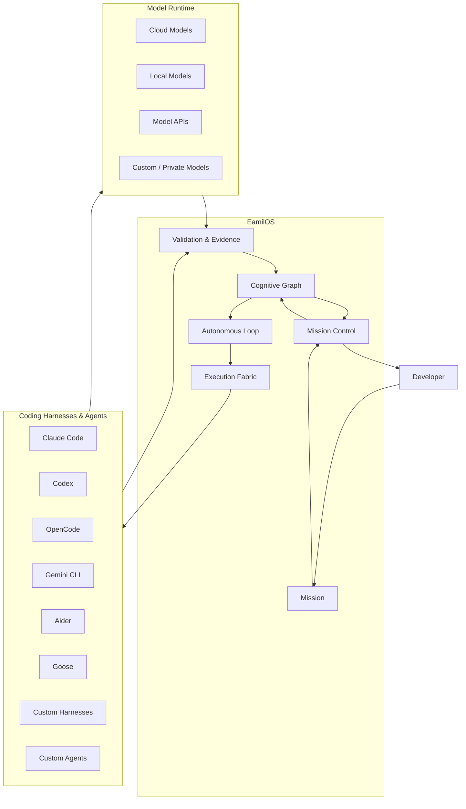

### The important distinction

EamilOS does **not** try to replace Claude Code, Codex, OpenCode, Gemini CLI, Aider, Goose, or your own tooling.

It **orchestrates them**.

They remain execution engines.

EamilOS becomes the layer that coordinates the entire mission.

---

# Bring your entire AI coding stack

EamilOS is designed around a simple principle:

> **Your tools should become interchangeable execution capabilities rather than separate products you have to manually operate.**

| Source               | Role inside EamilOS                          |
| -------------------- | -------------------------------------------- |
| **Claude Code**      | Coding execution harness                     |
| **Codex**            | Coding execution harness                     |
| **OpenCode**         | Coding execution harness                     |
| **Gemini CLI**       | Coding execution harness                     |
| **Aider**            | Coding execution harness                     |
| **Goose**            | Agentic execution harness                    |
| **Custom agents**    | Specialized autonomous workers               |
| **Custom harnesses** | Organization-specific execution environments |
| **Cloud models**     | High-capability remote inference             |
| **Local models**     | Private / local inference                    |
| **Model APIs**       | External model providers                     |
| **Private models**   | Organization-controlled inference            |

The mission does not need to care which one ultimately performs a particular task.

---

# From agents to a mission

A traditional coding-agent workflow looks like this:

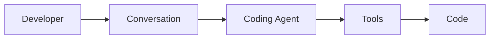

EamilOS expands the abstraction.

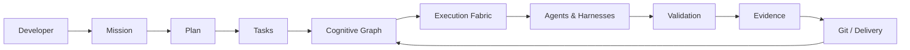

This is the core idea behind EamilOS.

You are no longer managing individual conversations.

You are managing **software missions**.

---

# One mission. Many agents.

Imagine you ask:

> **Build a production-ready authentication system with OAuth, refresh tokens, tests, documentation, and a pull request.**

EamilOS can turn that objective into coordinated work.

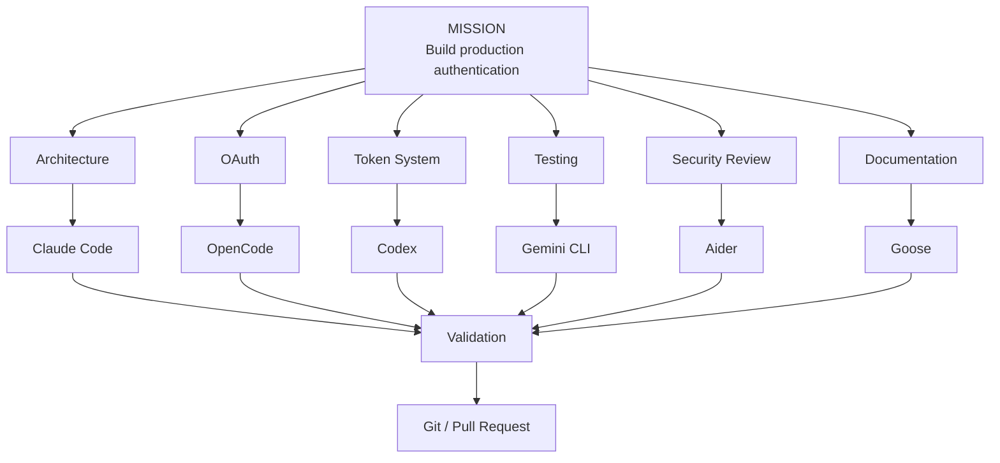

Different tasks can use different execution engines.

The developer still sees **one mission**.

---

# The execution fabric

EamilOS treats execution as a resource that can move.

A task does not have to remain permanently attached to one agent, machine, or model.

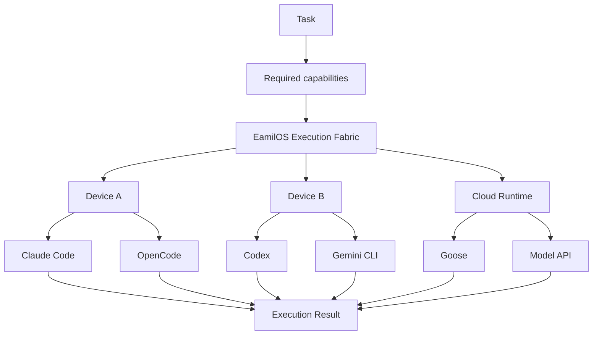

This allows EamilOS to reason about:

* capabilities
* availability
* execution state
* device health
* agent state
* model availability
* task requirements
* recovery
* validation

rather than treating every agent as an isolated terminal session.

---

# Local + cloud + API + custom

EamilOS is not tied to one model provider.

Your execution environment can contain multiple types of intelligence.

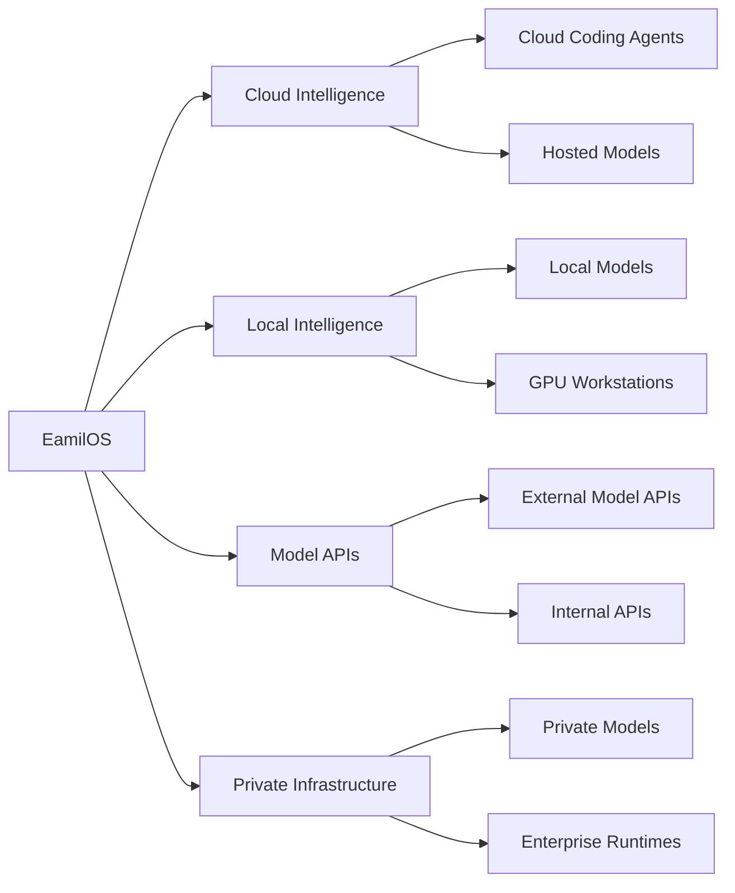

The important abstraction is not the model.

It is the **capability available to the mission**.

---

# Missions are the primary abstraction

EamilOS is mission-first.

A mission contains the complete state required to understand and execute a software objective.

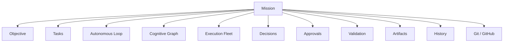

At any moment, EamilOS should be able to answer:

* What am I trying to achieve?
* What is happening?
* What is running?
* What is blocked?
* What failed?
* What needs my approval?
* Which agent is doing the work?
* Where is that agent running?
* What changed?
* What was validated?
* Why did EamilOS make this decision?
* What happens next?

---

# The cognitive graph

Everything important becomes connected.

Tasks connect to executions.

Executions connect to agents.

Agents connect to devices.

Tasks produce artifacts.

Artifacts become commits.

Commits become pull requests.

Decisions explain changes in execution.

Validation provides evidence.

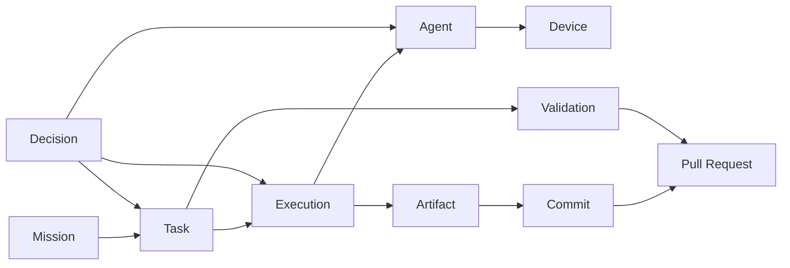

The graph gives EamilOS something a normal coding-agent session does not need:

> **A persistent model of the entire software mission.**

---

# Autonomous execution

EamilOS uses a continuous execution loop.

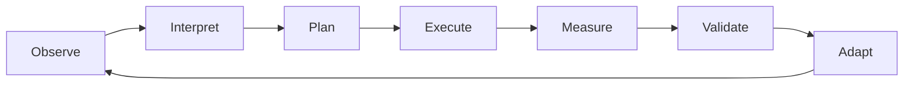

The loop allows the system to react to what actually happens rather than assuming that the original plan will always work.

---

# Autonomous recovery

Agents fail.

Machines disconnect.

Processes crash.

APIs become unavailable.

A task may need to move.

EamilOS treats failure as part of execution rather than the end of the mission.

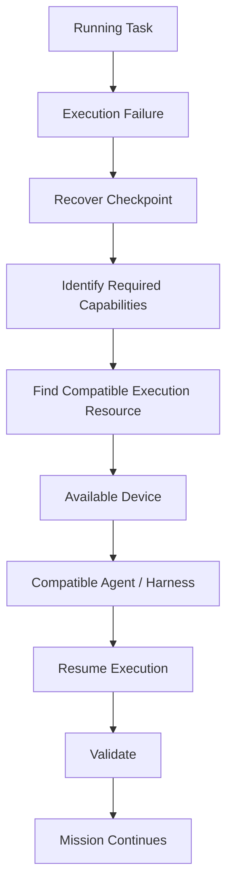

The goal is not simply:

**"Agent failed."**

The goal is:

**"The mission continued."**

---

# Decisions with provenance

Autonomous systems need to explain what happened.

EamilOS tracks decisions as first-class mission objects.

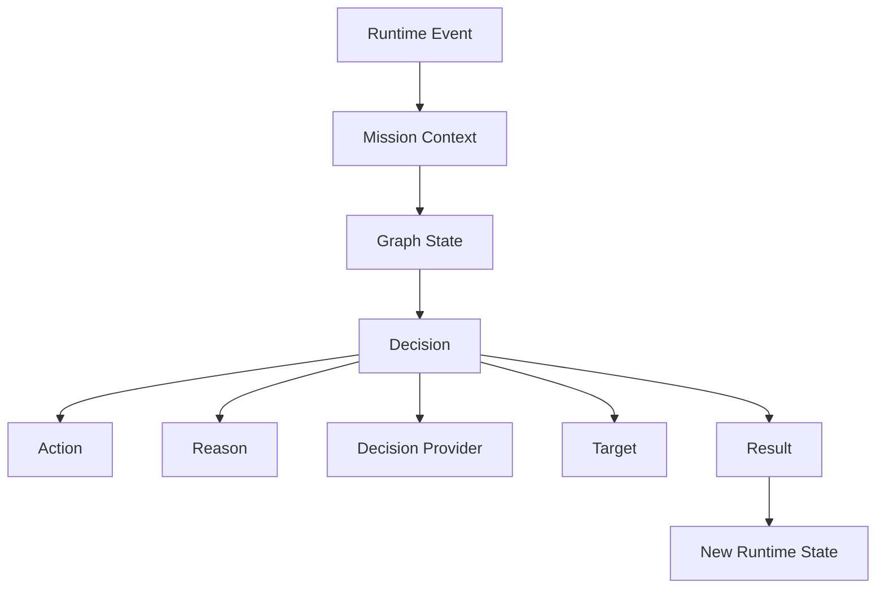

A decision can therefore be understood in context:

**What happened → what EamilOS knew → what it decided → why → what changed.**

---

# Human control remains first-class

Autonomy does not mean surrendering control.

EamilOS can surface decisions that require intervention.

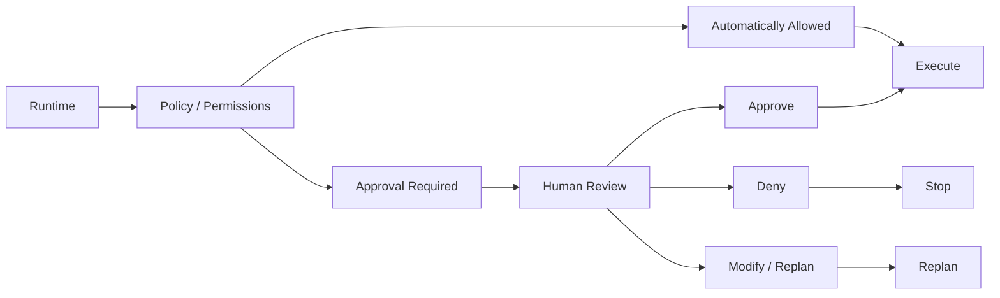

You can intervene with actions such as:

* pause
* resume
* stop
* retry
* reassign
* replan
* approve
* deny
* inspect
* continue

The mission remains observable throughout.

---

# The EamilOS terminal

The TUI is not simply a prettier chat interface.

It is the **mission control surface**.

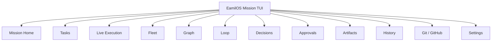

The interaction model is designed around the mission rather than a single agent conversation.

---

# One interface, many execution engines

From the user's perspective:

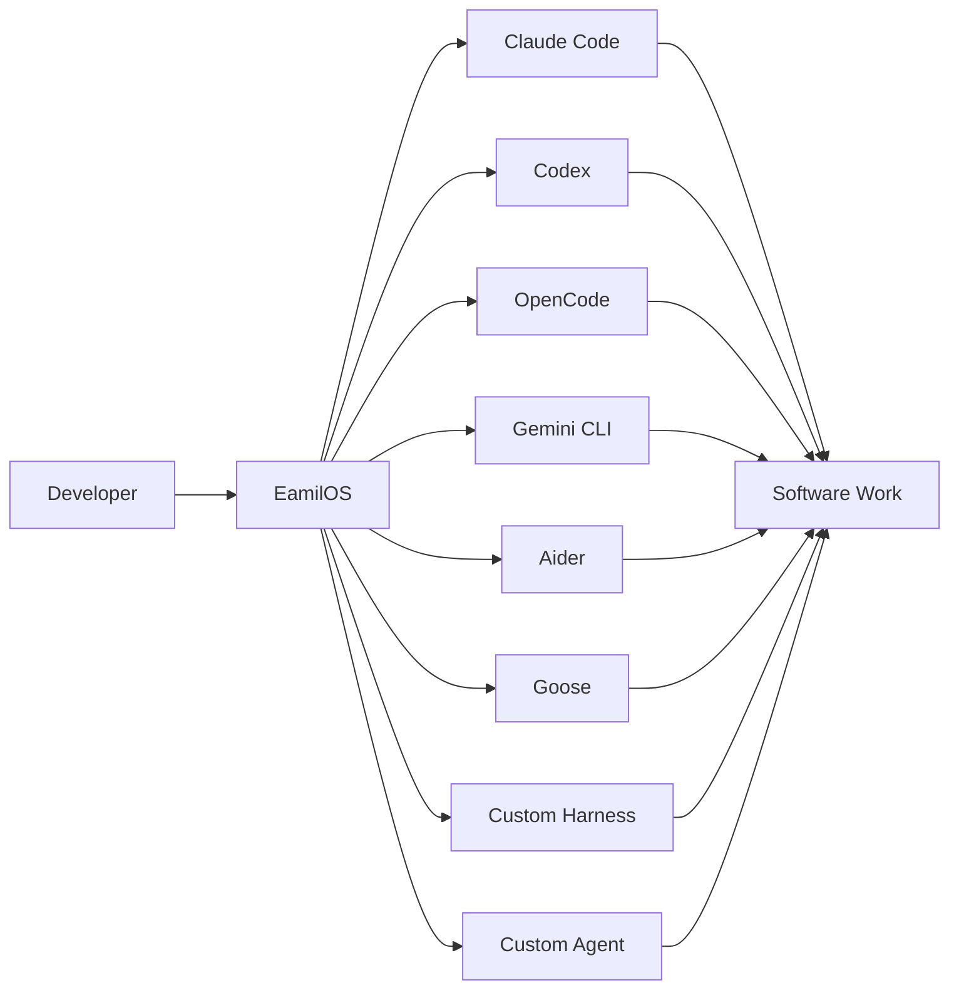

The developer does not need to manually orchestrate every execution path.

---

# A unified command surface

EamilOS provides one command vocabulary over the mission runtime.

Examples:

```bash
eamilos
```

Open the full mission interface.

```bash
eamilos run "Build a production-ready authentication system"
```

Start a mission.

```bash
eamilos status
```

Inspect mission state.

```bash
eamilos mission
```

Open mission control.

```bash
eamilos fleet
```

Inspect available execution resources.

```bash
eamilos graph
```

Inspect the cognitive graph.

```bash
eamilos decisions
```

Inspect autonomous decisions.

```bash
eamilos history
```

Inspect mission history.

For automation and machine interfaces, EamilOS can expose non-interactive and structured execution paths as well.

---

# Built for developers who already use AI coding agents

EamilOS does not ask you to abandon your existing workflow.

It gives that workflow an orchestration layer.

| You already have  | EamilOS adds                    |
| ----------------- | ------------------------------- |
| Claude Code       | Mission-level coordination      |
| Codex             | Cross-agent execution           |
| OpenCode          | Unified state and control       |
| Gemini CLI        | Mission-wide recovery           |
| Aider             | Shared Git and validation state |
| Goose             | Fleet-level orchestration       |
| Custom agents     | Standardized execution          |
| Local models      | Mission integration             |
| Cloud models      | Mission integration             |
| APIs              | Unified provider boundary       |
| Multiple machines | Execution fabric                |
| GitHub            | Mission-aware delivery          |

---

# What makes EamilOS different?

### Traditional coding agents

The primary abstraction is generally an **agent session**.

### EamilOS

The primary abstraction is a **software mission**.

That changes the entire control model.

|                          | Coding Agent            | EamilOS          |
| ------------------------ | ----------------------- | ---------------- |
| Primary abstraction      | Session                 | Mission          |
| Agents                   | One primary agent       | Many             |
| Harnesses                | One environment         | Multiple         |
| Devices                  | Usually implicit        | First-class      |
| Models                   | Session-level           | Mission-level    |
| Tasks                    | Conversation-driven     | Graph-driven     |
| Recovery                 | Agent/session dependent | Mission-aware    |
| Decisions                | Mostly internal         | Traceable        |
| Validation               | Task/tool level         | Mission evidence |
| Git                      | Repository workflow     | Mission delivery |
| Fleet                    | Usually absent          | First-class      |
| Autonomous loop          | Agent-specific          | Mission-level    |
| Human approvals          | Local                   | Mission-level    |
| Execution graph          | Limited                 | Persistent       |
| Cross-agent coordination | Limited                 | Core abstraction |

---

# Validation is part of execution

"Code generated" does not mean "mission complete."

EamilOS treats validation as a first-class stage.

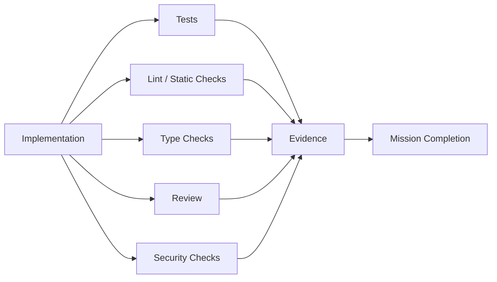

The result is not simply:

> "The agent says it worked."

It is a mission state backed by observable execution and validation.

---

# Git is part of the mission

Software work ultimately needs to become software delivery.

EamilOS connects execution with Git-aware state.

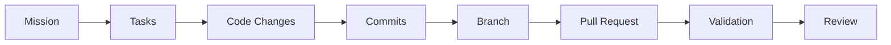

The mission can therefore connect:

**objective → work → changes → validation → pull request**

---

# Complete observability

EamilOS exposes the state behind autonomous execution.

At any point, you can inspect:

### Mission

Objective, progress, state, budget, completion.

### Tasks

Dependencies, ownership, execution state, attempts.

### Agents

Current task, status, capability, health.

### Devices

Availability, capabilities, health, workload.

### Models

Provider, runtime, availability, usage.

### Decisions

Action, reason, provider, context, result.

### Loop

Current stage, iteration, adaptation, validation.

### Graph

Relationships between all mission entities.

### Artifacts

Files, outputs, commits, pull requests.

### History

Events, checkpoints, executions, recovery.

---

# The architecture

The product can be understood as several cooperating layers.

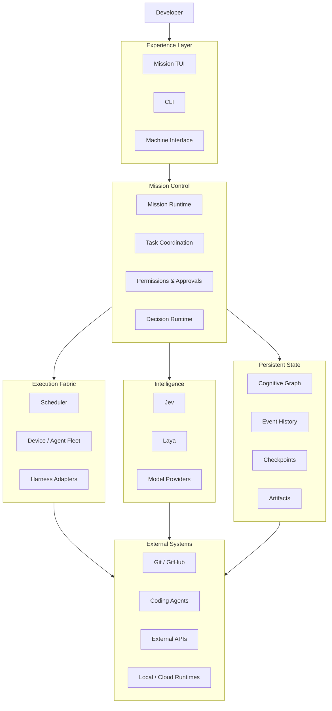

---

# A unified abstraction over heterogeneous systems

The underlying tools can be completely different.

One agent may be a CLI.

Another may be a remote API.

Another may be a local model.

Another may be a custom enterprise harness.

EamilOS normalizes them around mission execution.

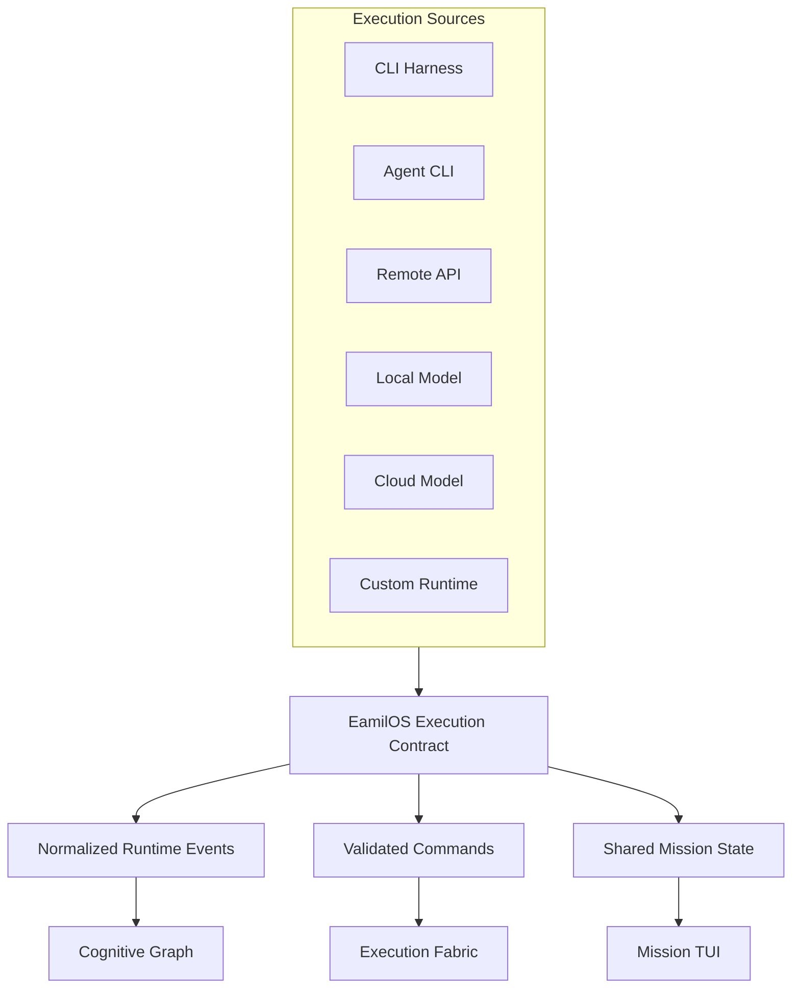

This is what allows EamilOS to coordinate heterogeneous execution without forcing every tool to become the same tool.

---

# Designed around failure, not just success

A serious autonomous coding system must assume that things go wrong.

EamilOS is designed around:

* worker failure
* device disconnects
* agent crashes
* model unavailability
* interrupted execution
* validation failures
* blocked tasks
* approval requirements
* stale graph state
* network interruption
* TUI disconnects
* process restarts

The critical architectural property is:

> **The mission runtime must outlive the interface displaying it.**

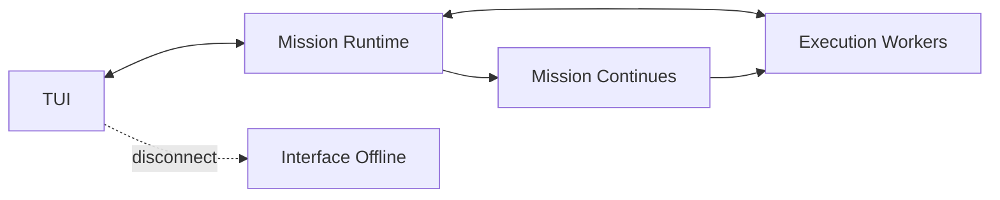

You can reconnect to the mission instead of losing the mission because the terminal disappeared.

---

# Human + AI + infrastructure

EamilOS sits at the intersection of three systems.

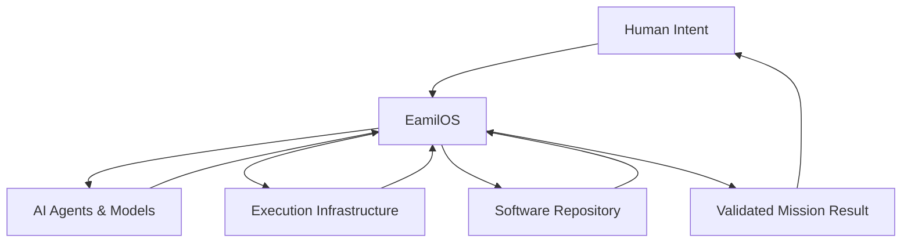

The human defines the objective and retains authority.

AI systems perform reasoning and execution.

Infrastructure provides the resources.

EamilOS coordinates the entire system.

---

# Extensible by design

EamilOS is intended to grow without replacing the core execution model.

You can extend:

* harness adapters
* agents
* model providers
* execution providers
* decision providers
* validation providers
* Git integrations
* plugins
* device capabilities
* mission commands

The important boundary is that extensions participate in the mission runtime rather than creating isolated execution paths.

---

# For developers

EamilOS is built as a TypeScript/Node.js system with a CLI/TUI architecture and a mission-oriented runtime.

Core technologies include:

* TypeScript
* Node.js
* SQLite
* Zod
* WebSockets
* Git integration
* Commander
* YAML
* plugin architecture
* terminal-native UI

The repository is organized around the CLI, runtime, TUI, integrations, and execution infrastructure.

---

# Installation

```bash
npm install -g @eamilos/cli
```

Then:

```bash
eamilos
```

Or start a mission directly:

```bash
eamilos run "Build a production-ready REST API"
```

---

# The mental model

Think about EamilOS as a layer between **what you want built** and **the tools capable of building it**.

```mermaid
flowchart TB

    INTENT["What I want"]

    INTENT --> MISSION["EamilOS Mission"]

    MISSION --> REASON["Reason"]
    MISSION --> PLAN["Plan"]
    MISSION --> COORDINATE["Coordinate"]
    MISSION --> EXECUTE["Execute"]
    MISSION --> RECOVER["Recover"]
    MISSION --> VALIDATE["Validate"]
    MISSION --> DELIVER["Deliver"]

    EXECUTE --> TOOLS["Agents / Harnesses / Models"]

    TOOLS --> CLAUDE["Claude Code"]
    TOOLS --> CODEX["Codex"]
    TOOLS --> OPEN["OpenCode"]
    TOOLS --> GEMINI["Gemini CLI"]
    TOOLS --> AIDER["Aider"]
    TOOLS --> GOOSE["Goose"]
    TOOLS --> CUSTOM["Custom"]

    DELIVER --> RESULT["Working Software"]
```

That is the product.

---

# The bigger idea

The future of AI-assisted software engineering does not have to be:

> one developer + one AI agent + one terminal session.

It can be:

> **one developer + one mission + an entire execution fabric of specialized AI systems.**

EamilOS is built around that model.

Your agents remain your agents.

Your models remain your models.

Your machines remain your machines.

Your repositories remain your repositories.

**EamilOS connects them into one coherent system.**

---

# EamilOS in one sentence

> **EamilOS is a unified coding harness and mission-control layer that turns Claude Code, Codex, OpenCode, Gemini CLI, Aider, Goose, custom agents, cloud models, local models, and APIs into one coordinated software-engineering system.**

---

## One mission. Every agent. One execution system.

**Bring the tools you already use.**

**Give EamilOS the objective.**

**Let the mission run.**
