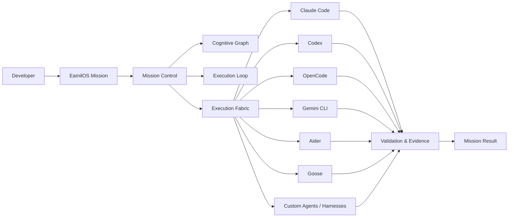
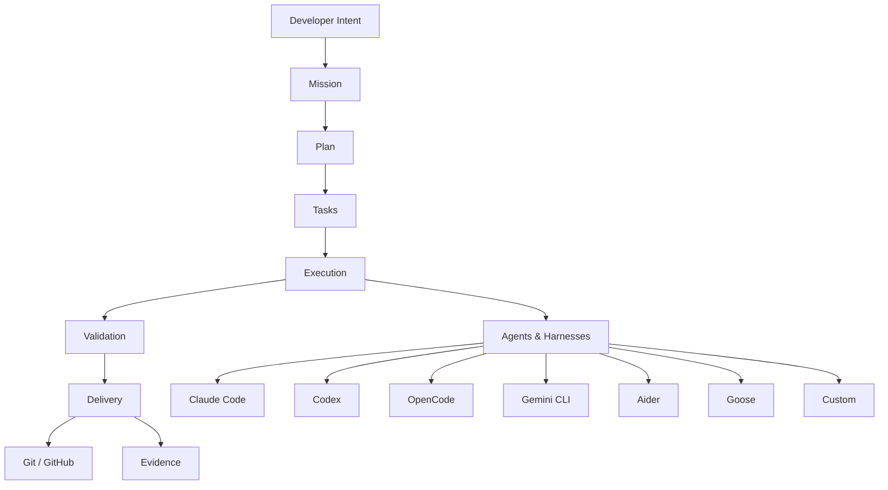
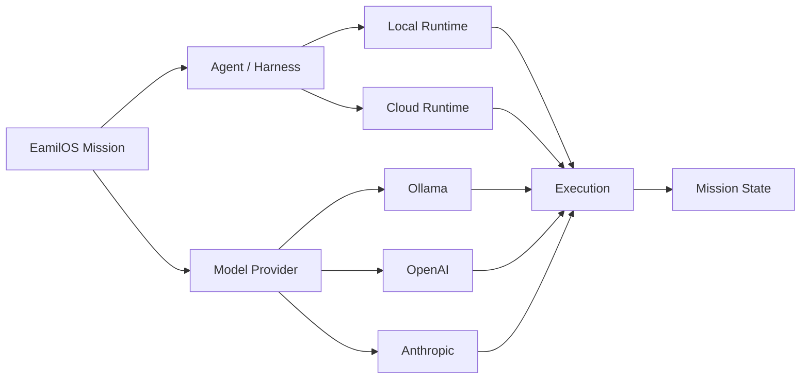
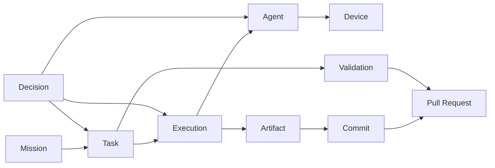
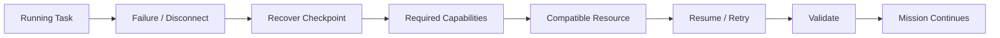
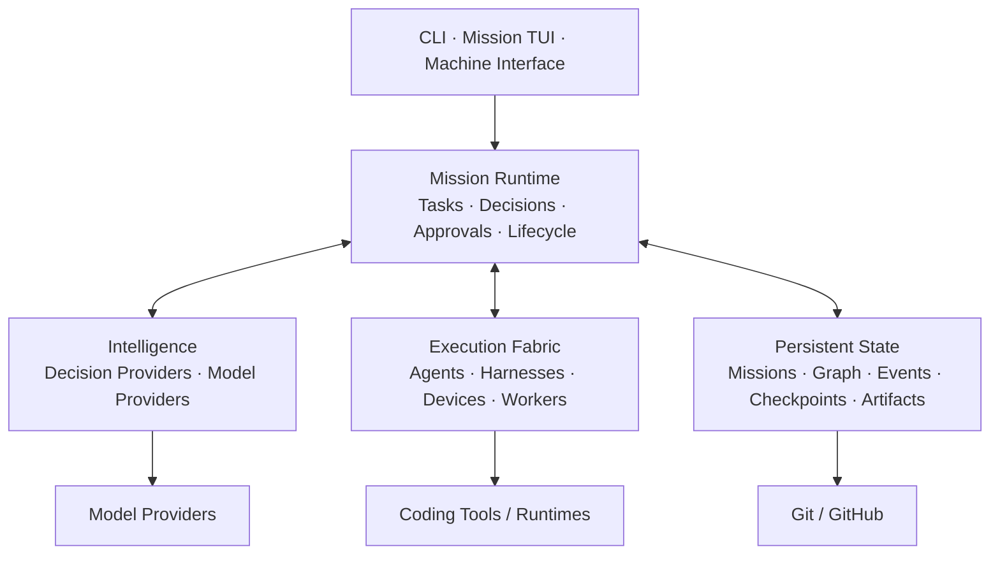

# EamilOS

## One coding harness for every AI coding agent.

**Claude Code. Codex. OpenCode. Gemini CLI. Aider. Goose. Custom agents. Different models. Different machines. One mission.**

EamilOS is a **mission-oriented orchestration layer for AI software engineering**. It sits above coding agents and execution resources so a developer can coordinate software work as one mission instead of manually managing disconnected agent sessions.

> **Stop switching between coding agents. Start running software missions.**

---

## The product

EamilOS does not try to replace the coding tools you already use.

It gives them a common mission layer.



The core distinction is:

**Agents execute. EamilOS coordinates the mission.**

---

# Why EamilOS?

AI coding agents are powerful, but developers increasingly end up operating several of them independently.

A project may involve:

- Claude Code for implementation
- Codex for another task
- OpenCode for a different execution path
- Gemini CLI for another workflow
- Aider for Git-heavy work
- Goose for automation
- custom agents for specialized tasks
- local models for private workloads
- cloud providers when remote inference is useful
- multiple machines or worker nodes

Each tool can have its own context, session, commands, permissions, state, and history.

EamilOS changes the primary question from:

> **Which agent should I use?**

to:

> **What do I want built?**

The mission becomes the stable abstraction. Agents become execution capabilities.

---

# Mission first

A conventional coding-agent workflow is centered on a session.

EamilOS is centered on a **software mission**.



A mission can therefore contain multiple tasks, executions, agents, decisions, artifacts, validations, and delivery events without requiring the developer to manually stitch those sessions together.

---

# Bring the agents you already use

The current repository contains agent implementations for:

| Agent / harness | Current repository status |
|---|---|
| **Claude Code** | Agent implementation present |
| **Codex CLI** | Agent implementation present |
| **OpenCode** | Agent implementation present |
| **Gemini CLI** | Agent implementation present |
| **Aider** | Agent implementation present |
| **Goose** | Agent implementation present |
| **Custom agents** | Base-agent abstraction available |

These integrations live under the CLI's multi-agent layer.

An adapter being present does **not** mean the corresponding external tool is automatically installed, authenticated, or equally available on every machine. EamilOS works with the execution resources actually available in the environment.

That distinction is intentional.

---

# Models and providers

Agents and models are separate concepts in EamilOS.

The current CLI includes provider detection/setup paths for:

- Ollama
- OpenAI
- Anthropic

This lets the execution environment combine different agent and provider configurations without making the model itself the mission abstraction.



The product boundary is therefore not a particular model.

**The product boundary is the mission.**

---

# What a mission knows

EamilOS's mission architecture brings together:

| Layer | Purpose |
|---|---|
| **Objective** | What the developer wants accomplished |
| **Tasks** | Work required to reach the objective |
| **Execution** | What is currently running |
| **Agents** | Which execution engines are performing work |
| **Fleet** | Devices and worker resources |
| **Graph** | Relationships between mission entities |
| **Loop** | Observe → Interpret → Plan → Execute → Measure → Validate → Adapt |
| **Decisions** | Actions and their provenance |
| **Approvals** | Human-controlled actions |
| **Artifacts** | Outputs produced during execution |
| **Validation** | Evidence supporting completion |
| **History** | Events and checkpoints |
| **Git** | Changes and delivery state |

The result is a persistent representation of the software work rather than a transient conversation.

---

# Cognitive Execution Graph

The graph connects the things that matter to a mission.

Tasks connect to executions.

Executions connect to agents and devices.

Executions produce artifacts.

Artifacts become commits.

Commits can become pull requests.

Decisions explain changes.

Validation provides evidence.



The graph is more than a visualization. It gives the runtime a persistent model of **what exists, what depends on what, what happened, and how execution relates to the resulting software**.

---

# Autonomous execution

EamilOS's loop architecture is built around:

**Observe → Interpret → Plan → Execute → Measure → Validate → Adapt**

This is the layer that turns the system from a simple multi-agent launcher into a mission runtime.

The loop can react to actual runtime state rather than assuming the original plan will always succeed.

The project also contains decision, plan, and approval models so autonomous behavior can remain observable and controllable.

---

# Recovery is part of the mission

Real execution fails.

Workers disappear. Agents crash. Devices disconnect. Providers become unavailable. Validation fails.

EamilOS treats recovery as part of mission execution.



The goal is not to claim that agents never fail.

The goal is to make mission state **recoverable when execution fails**.

---

# Decisions, approvals, and human control

Autonomy does not remove human authority.

EamilOS includes first-class concepts for:

- decisions
- plans
- decision providers
- approvals
- approval risk
- approval scope
- approval resolution
- pause
- resume
- stop
- retry
- reassign
- replan

The architecture also includes bounded intelligence-provider concepts such as **Jev** and **Laya**, while keeping deterministic mission state, execution, and validation separate from model judgment.

---

# Validation and evidence

Generated code is not automatically a completed mission.

EamilOS treats validation as part of the lifecycle.

Depending on the mission, validation can include:

- tests
- type checking
- static checks
- repository state
- task completion
- execution evidence
- Git state
- mission consistency

The important distinction is:

**work happened**

versus

**the mission has evidence that the required work is complete.**

---

# Git-aware delivery

Software work ultimately becomes repository state.

EamilOS connects mission work with Git-aware execution and delivery:

**Objective → Tasks → Code Changes → Commits → Validation → Pull Request**

The goal is to keep the final software artifact connected to the mission that produced it.

---

# The Mission TUI

EamilOS includes a full-screen terminal UI designed around the mission rather than a single agent conversation.

Current TUI views include:

- Mission
- Live Execution
- Tasks
- Artifacts
- Sessions
- GitHub
- Fleet
- Graph
- Loop
- Decisions
- Approvals
- Chat
- Logs

The TUI also includes:

- command palette
- slash commands
- centralized keymap
- responsive layouts
- mouse input parsing
- TTY-safe rendering
- reduced-motion support
- ASCII fallback
- contextual notifications
- terminal resize handling

The runtime remains the source of truth. The TUI is a client for observing and controlling it.

---

# Current architecture status

EamilOS is an active implementation. The README intentionally distinguishes what exists today from what depends on external environments and what remains a direction.

## Implemented in the current repository

- Mission runtime and MissionControl
- Persistent mission creation, listing, inspection, and lifecycle
- Task coordination
- Project execution
- Multi-agent execution layer
- Claude Code integration
- Codex CLI integration
- OpenCode integration
- Gemini CLI integration
- Aider integration
- Goose integration
- Base-agent abstraction
- Agent/provider detection
- Single, fallback, swarm, and manual execution strategies
- Fleet/device state
- Cognitive Execution Graph
- Loop state and lifecycle
- Decisions
- Plans
- Approvals
- Artifacts
- Sessions
- GitHub state integration
- Full-screen TUI
- Mission-oriented navigation
- Command registry
- Command palette
- Slash-command handling
- Central keymap and conflict detection
- Responsive terminal layout
- Mouse input parsing
- TTY-safe terminal handling
- Reduced-motion and ASCII fallback modes
- Plugin management
- Worker/connect infrastructure
- Validation and test infrastructure

## Evolving / provider-dependent

- External agents require their respective tools, authentication, and environment configuration.
- Model availability depends on configured providers and credentials.
- Distributed execution depends on worker/network configuration.
- Cross-agent behavior depends on the capabilities and behavior exposed by each adapter.
- The unified mission experience is still evolving as runtime and integrations mature.

## Direction

The longer-term goal is a single durable mission abstraction across:

- interactive TUI use
- CLI automation
- machine-readable interfaces
- heterogeneous agents
- model providers
- distributed execution
- autonomous recovery
- validation
- Git delivery

The distinction matters:

> **EamilOS is ambitious about where the architecture is going without pretending every part of that architecture is finished today.**

---

# Architecture

The system can be understood as five cooperating layers.



The TUI and CLI are interfaces to the runtime.

The runtime owns mission state.

Execution resources perform work.

The graph and event history preserve what happened.

Validation and Git state provide evidence around the resulting software.

---

# CLI

The repository currently exposes two related command layers: the established project/agent CLI and the newer persistent mission/control-plane CLI.

They are both real today, so they are documented separately rather than being presented as a future unified command surface.

## Core execution

Launch the TUI:

```bash
eamilos
```

Run a goal:

```bash
eamilos run "Build a production-ready REST API"
```

Inspect project state:

```bash
eamilos status
eamilos list
```

Control a project:

```bash
eamilos pause <project>
eamilos resume <project>
eamilos cancel <project>
eamilos retry <project>
```

Inspect runtime information:

```bash
eamilos agents
eamilos cost
eamilos decisions <project-id>
eamilos history <project-id>
```

## Persistent missions

Create a mission:

```bash
eamilos mission create "Build a production-ready authentication system"
```

Run a mission:

```bash
eamilos mission run "Build a production-ready authentication system"
```

Inspect missions:

```bash
eamilos mission list
eamilos mission show <mission-id>
```

The mission command family also provides lifecycle operations for starting, controlling, and reporting on persistent missions.

## Cognitive graph

```bash
eamilos graph show <mission-id>
eamilos graph verify <mission-id>
eamilos graph why <mission-id> <task-id>
```

## Runtime and infrastructure

```bash
eamilos doctor
eamilos setup
eamilos validate
eamilos connect
eamilos worker
eamilos plugins
```

---

# Installation

Install the published CLI:

```bash
npm install -g @eamilos/cli
```

Launch:

```bash
eamilos
```

For development:

```bash
git clone https://github.com/RayAKaan/EamilOS.git
cd EamilOS
npm install
npm run build
npm test
```

Type-check:

```bash
npm run typecheck
```

The root project currently targets Node.js 20+.

---

# Configuration

Interactive setup:

```bash
eamilos setup
```

Explicit provider/model configuration:

```bash
eamilos setup --provider ollama --model <model>
```

Diagnostics:

```bash
eamilos doctor
```

Provider and execution availability depends on what is installed and configured on the machine.

---

# Repository structure

EamilOS is a TypeScript monorepo centered around the CLI.

| Area | Purpose |
|---|---|
| `packages/cli/src/core` | Core runtime and mission systems |
| `packages/cli/src/commands` | CLI command implementations |
| `packages/cli/src/multi-agent` | Agent abstractions, adapters, orchestration, and graph support |
| `packages/cli/src/tui` | Full-screen terminal UI |
| `packages/cli/src/terminal` | Terminal input, rendering, and surface handling |
| `packages/cli/src/detection` | Provider/environment detection |
| `packages/cli/src/__tests__` | Tests |

The CLI package also exposes core and multi-agent modules through package exports.

---

# Technology

Current implementation includes:

- **TypeScript**
- **Node.js**
- **SQLite / better-sqlite3**
- **Commander**
- **Zod**
- **WebSockets**
- **simple-git**
- **YAML**
- **esbuild**
- **Vitest**
- terminal-native rendering
- plugin infrastructure

---

# Extensibility

EamilOS is built around replaceable execution capabilities.

Extension points include:

- agent adapters
- custom agents
- execution providers
- model providers
- decision providers
- validation providers
- Git integrations
- plugins
- worker nodes
- mission commands

A new execution engine should become another capability the mission runtime can coordinate, rather than becoming a second mission runtime.

---

# Design principles

### Mission first

The developer thinks about the outcome, not which process happens to execute the next command.

### Agents are capabilities

Claude Code, Codex, OpenCode, Gemini CLI, Aider, Goose, and custom agents are execution resources.

### Observable autonomy

Autonomous behavior should leave understandable state, events, decisions, and evidence.

### Recovery over fragility

Execution failure should be recoverable whenever mission state and available capabilities permit it.

### Human control

Automation should not make intervention an afterthought.

### Runtime/UI separation

The TUI observes and controls the runtime; it does not own mission execution.

### Evidence over assertion

Completion should be supported by validation and recorded state, not only by an agent's claim.

### Extensible execution

New agents, models, providers, and runtimes should participate through the mission abstraction.

---

# What EamilOS is not

EamilOS is not:

- a replacement for Claude Code
- a replacement for Codex
- another single-model coding assistant
- a chat wrapper around one LLM
- a requirement that every task use the same agent
- a UI that owns the execution runtime

It is the layer that coordinates those systems around a larger unit of work.

---

# The bigger idea

The first generation of AI coding tools made individual agents dramatically more capable.

The next problem is coordination.

What happens when a project needs:

- one agent for architecture
- another for implementation
- another for testing
- another for review
- a local model for private work
- a cloud provider for another workload
- another machine when a worker becomes unavailable
- approval before a sensitive action
- persistent state across the project
- evidence connecting execution to the final repository change

That is the problem EamilOS is built to explore.

Not:

> **Which AI agent is the best?**

But:

> **How do we make many capable AI systems behave like one coherent software-engineering environment?**

---

# EamilOS in one sentence

> **EamilOS is a mission-oriented orchestration layer that brings AI coding agents, harnesses, models, execution resources, validation, and Git delivery into one coherent software-engineering system.**

---

## One mission. Many agents. One control plane.

**Bring the coding tools you already use.**

**Define the outcome.**

**Let EamilOS coordinate the work.**

---

## License

MIT
